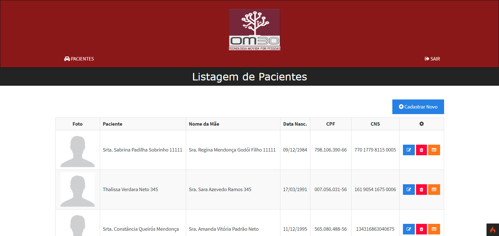

<h4 align="center">
  🚀 OM30-Medical - Gerenciamento de Pacientes - Teste técnico
</h4>

<p align="center">
 

  
</p>

<p align="center">
  <a href="#rocket-tecnologias">Tecnologias</a>&nbsp;&nbsp;&nbsp;|&nbsp;&nbsp;&nbsp;
  <a href="#-projeto">Projeto</a>&nbsp;&nbsp;&nbsp;|&nbsp;&nbsp;&nbsp;
  <a href="#-funcionalidades">Funcionalidades</a>&nbsp;&nbsp;&nbsp;|&nbsp;&nbsp;&nbsp;
  <a href="#-requisitos">Requisitos</a>&nbsp;&nbsp;&nbsp;|&nbsp;&nbsp;&nbsp;
  <a href="#-instalação">Instalação</a>&nbsp;&nbsp;&nbsp;|&nbsp;&nbsp;&nbsp;
</p>

<br>

<p align="center">
  
</p>

## :rocket: Tecnologias

Esse projeto foi desenvolvido com as seguintes tecnologias:

- [PHP 7.4](https://php.net/)
- [Composer](https://getcomposer.org)
- [Codeigniter 4](https://codeigniter.com/)
- [PostgreSQL](https://www.postgresql.org/)
- [Docker](https://docker.com)
- [Docker Compose](https://docker.com)


## 💻 Projeto

Esse projeto é um sistem  desenvolvido como teste técnico para o processo seletivo de Desenvolvedor Fullstack PHP para OM30.

## 💻 Funcionalidades

O sistema possui gerenciamento de pacientes onde é possível fazer a listagem, edição, visualização e exclusão dos mesmos.
Além disso, possui upload de fotos do paciente, paginação, validações de campos com mensagens de erro descritivas e 
sistema de login simples.

O sistema utiliza vários recursos avançados do framework Codeigniter 4 como Migrations, Seeds, Routes, Helpers, Filters, 
Query Builder, custom validations, templates e pagination.
 
## 📄 Requisitos

* PHP 7.3+, Composer, Codeigniter 4, PostgreSQL 10+ e Docker/Docker-Compose

## ⚙️ Instalação e execução

**Windows, OS X & Linux:**

Baixe o arquivo zip e o descompacte ou baixe o projeto para sua máquina através do git clone [https://github.com/randercarlos/OM30-Medical.git](https://github.com/randercarlos/OM30-Medical.git)


- Entre no prompt de comando e vá até a pasta do projeto:

```sh
cd ir-ate-a-pasta-do-projeto
```

- Crie o arquivo .env a partir do arquivo env. As variáveis de ambiente relacionadas ao banco já estão configuradas caso 
utilize o Docker.

```sh
copy env .env
```

- Assumindo que tenha o docker e docker-compose instalado e rodando no PC, execute o comando:

```sh
docker-compose up -d
```

- Após os serviços estarem rodando, as dependências já terão sido instaladas. Será necessário rodar as migrations e os seeds. 
Para rodar as migrations, execute:

```sh
docker-compose exec app php spark migrate
```

- E, por último, rode as seeds através do comando:

```sh
docker-compose exec app php spark db:seed PatientSeeder
```

- Se tudo foi executado com sucesso, acesse a aplicação na seguinte URL [http://localhost:8000](http://localhost:8000).

- Na tela de login, informar as seguintes credenciais para acessar o sistema: *Email*: admin@admin.com, *Senha*: admin

- Caso não tenha o Docker instalado ou ele não esteja rodando, instale o PHP 7.3+, composer e o postgreSQL 10+ na sua máquina, 
crie um banco de dados no PostgreSQL, configure a conexão com o banco de dados no arquivo .env e rode os comandos abaixo na pasta raiz do projeto: 
  
```sh
php spark migrate
php spark db:seed PatientSeeder
php -S localhost:8000 -t public/
```
- Acesse o seguinte endereço  [http://localhost:8000](http://localhost:8000) no navegador para ver o projeto rodando.

- Na tela de login, informar as seguintes credenciais para acessar o sistema: *Email*: admin@admin.com, *Senha*: admin 


Desenvolvido por Rander Carlos :wave: [Linkedin!](https://www.linkedin.com/in/rander-carlos-caetano-freitas-308a63a8/)
